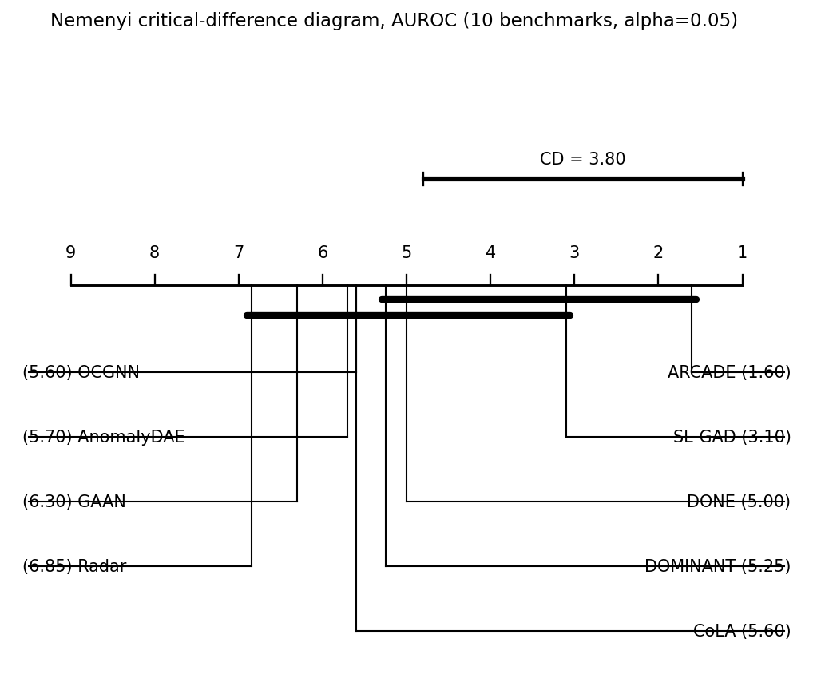
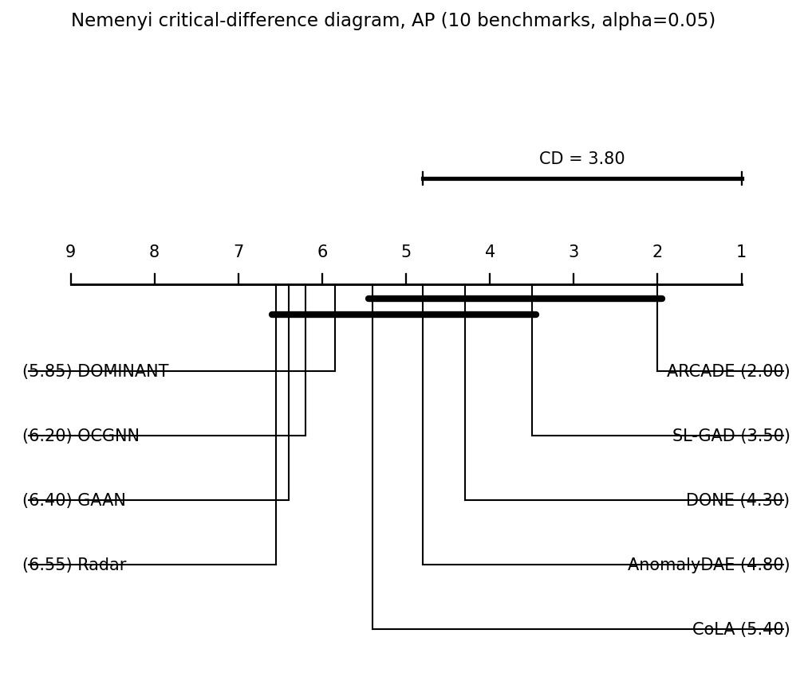

# ARCADE: Adaptive Reasoned Composition for Anomaly Detection in Graphs

No single unsupervised detector works on every graph: each one assumes one anomaly mechanism, and every assumption fails somewhere. With no labels, choosing the right detectors is a reasoning task, usually done by a human expert. ARCADE automates this role: a detector library that covers the main anomaly mechanisms, a label-free evidence interface that describes the graph to an analyst, a language-model analyst (any LLM) that selects a small set of detectors from that evidence, and a label-free gate that composes their scores. Labels are used exactly once, at the end, to measure the result.

**Extended version.** `paper/ARCADE-extended.pdf` carries the full detector library, the per-detector results on every benchmark, and the ablations that the short conference paper has no room for. The tables below are the extended set: the short paper reports the main benchmark table, the analyst study and the evidence ablation, and points here for the rest.

## Results (AUROC %, mean ± std over 5 seeds)

All 10 benchmarks under one protocol, every method run on our hardware: PyGOD defaults for the seven standard baselines, plus Radar, SL-GAD through a validated port of the authors' code, AutoGAD from its released code. `AutoGAD†` selects configurations by measured AUROC (label-guided) and is excluded from the best-baseline comparison. `/` = runtime failure or infeasible on our hardware (12 GB GPU) even with batched fitting (Radar on the three social graphs exceeded a 2-hour budget per cell). `Tolokers°` is a held-out graph never used during development, evaluated with every rule frozen (commit `ffb3217`; only the data loader changed).

| Dataset | DOMINANT | AnomalyDAE | DONE | CoLA | GAAN | OCGNN | Radar | SL-GAD | AutoGAD† | ARCADE |
|---|---|---|---|---|---|---|---|---|---|---|
| Enron       | 55.5±1.1 | 48.4±11.6 | 41.1±0.6 | 56.3±3.3  | 49.2±8.8 | 57.6±1.8 | 48.7±0.0 | 53.1±3.2 | 69.4 | **83.7±0.0** |
| Reddit      | 56.1±0.0 | 49.0±1.3  | 53.3±0.9 | 53.9±2.3  | 49.3±0.7 | 50.6±8.4 | 49.1±0.0 | 53.7±1.5 | 56.4 | **59.8±0.7** |
| Books       | 47.7±2.3 | 41.9±1.1  | 37.6±2.4 | 50.8±5.8  | 50.3±4.5 | 50.9±0.4 | 45.6±0.0 | 53.6±3.8 | 63.9 | **72.1±0.0** |
| Disney      | 59.7±7.8 | 48.5±0.1  | 40.8±0.6 | 50.5±13.1 | 48.0±0.0 | 66.9±0.6 | 51.8±0.0 | 58.9±3.5 | 67.4 | **86.4±0.0** |
| Weibo       | 90.0±0.5 | 87.6±1.1  | 85.2±0.2 | 24.0±2.1  | 89.9±0.0 | 21.7±2.6 | **95.1±0.0** | 49.9±1.3 | 93.3 | 94.9±0.0 |
| Cora        | 76.6±0.4 | 71.4±0.2  | 84.3±0.8 | 55.0±2.7  | /        | 50.0±0.0 | 50.2±0.0 | 86.4±1.4 | 84.9 | **93.6±0.0** |
| Amazon      | 71.8±0.0 | 75.1±0.0  | 84.8±3.1 | 60.9±1.4  | /        | 50.1±0.1 | 48.4±0.0 | **92.9±1.1** | 83.8 | 73.2±0.1 |
| BlogCatalog | /        | 74.7±0.0  | 77.2±0.7 | 49.5±3.0  | 50.1±1.0 | 48.1±0.5 | / | 77.4±0.2 | 77.3 | **78.9±0.1** |
| ACM         | /        | 74.0±0.1  | 92.1±0.7 | 46.5±1.6  | 50.8±0.2 | 50.4±1.2 | / | 80.6±0.8 | 89.6 | **98.9±0.1** |
| Flickr      | /        | 74.3±0.1  | 78.0±5.0 | 47.9±1.9  | 50.1±0.9 | 49.5±0.9 | / | **78.5±0.2** | /    | 76.8±0.3 |
| Tolokers°   | **55.5±0.0** | 48.5±6.4 | 51.4±1.2 | 48.1±0.5 | 50.2±1.8 | 37.4±1.4 | 43.1±0.0 | 49.7±0.3 | / | 52.3±0.0 |

ARCADE has the highest AUROC on 7 of the 10 benchmarks and a mean of 81.8; on Weibo it sits 0.2 below Radar, whose mechanism is the one the gate selects there (the Radar-style linear residual). The losses (Amazon, Flickr) are disclosed and analyzed in the paper; on Amazon the analyst mode recovers most of the loss (86.0 vs 73.2 for running everything). On the held-out Tolokers graph (organic anomalies, 10 features) the conformity trigger fires (duplicate-row rate 0.49) but the mechanism is weak (52.3), every baseline is weak too (best 55.5), and the best single library view (one-class, 62.7) has no trigger to reach it: the frozen rules transfer without collapse (the untriggered pool scores 48.3) but do not win, a concrete instance of the coverage limit. The analyst mode does not rescue it: in 27 decisions by 9 models (`llm_ablation/results_heldout.jsonl`), and again with every deep view probed in the evidence pack (`ABLATION_PROBE_ALL=1`, `results_heldout_probeall.jsonl`), none selects one-class; the trigger's grounding draws every selection to conformity.

*What would win Tolokers, and why we did not ship it.* The anomalies (banned crowd-workers, 21.8% of nodes) are attribute inliers with atypical structure: attribute-only outlierness is anti-signal (isolation forest 40.0, Mahalanobis 43.2), four library views are anti-signal (local affinity 39.4, homophily violation 39.6), and single raw features reach 65 to 67 AUROC. A conformity formula built on the negative Radar residual scores 63.2 here, above every baseline, but 41.6 on Enron, the other graph where the conformity trigger fires (current formula: 83.7 and 52.3); the gate's label-free tail-quality diagnostic prefers the Radar variant on *both* graphs (UED 0.67 vs 0.24 on Enron), so a diagnostic-selected formula would trade Enron for Tolokers. Unsupervised sign alignment of the score matrix (flip views that anti-correlate with the leading principal component) is worse still: it drops Enron from 83.7 to 26.3 and Weibo from 94.9 to 73.2. Generalizing the evidence probe to every deep view leaves all 27 analyst decisions on conformity. Every route to Tolokers we found needs labels or a graph-specific choice, which is the overfitting the held-out test exists to expose (`experiments/conformity_variants.py`, `conformity_diagnostics.py`). Because fusion is the last step, ARCADE always outputs the fused ranking and every selected detector's own ranking.

### Average precision (AP %, same runs and protocol)

AP for the exact same runs (`experiments/ap_table.json`; the rerun that attached AP reproduced every stored AUROC within seed variance, see `experiments/rebench_ap.log`). AutoGAD's AP survives only for the social graphs; its standard-benchmark artifact was overwritten before AP was logged.

| Dataset | DOMINANT | AnomalyDAE | DONE | CoLA | GAAN | OCGNN | Radar | SL-GAD | AutoGAD† | ARCADE |
|---|---|---|---|---|---|---|---|---|---|---|
| Enron       | 0.1  | 0.0  | 0.1  | 0.1  | 0.0  | 0.1 | 0.0 | 0.0      | /    | **1.4** |
| Reddit      | 3.7  | 3.2  | 3.8  | 4.1  | 3.4  | 3.1 | 3.2 | 3.4      | /    | **4.4** |
| Books       | 1.8  | 1.7  | 1.8  | 2.3  | 2.1  | 2.0 | 2.2 | 3.1      | /    | **5.2** |
| Disney      | 7.5  | 5.7  | 4.5  | 5.4  | 5.6  | 7.8 | 7.2 | 6.8      | /    | **30.7** |
| Weibo       | 25.5 | 29.9 | 29.8 | 2.9  | 32.2 | 2.7 | **35.0** | 14.1     | /    | 34.8 |
| Cora        | 18.3 | 14.0 | 32.3 | 6.0  | /    | 5.1 | 4.8 | 26.9     | /    | **61.7** |
| Amazon      | 12.2 | 35.2 | 22.5 | 10.3 | /    | 5.2 | 5.0 | **55.4** | /    | 17.4 |
| BlogCatalog | /    | 37.0 | 28.6 | 7.0  | 6.0  | 7.3 | / | **39.3** | 32.2 | 24.1 |
| ACM         | /    | 26.3 | 22.7 | 3.7  | 3.8  | 3.7 | / | 39.9     | 26.0 | **80.5** |
| Flickr      | /    | 39.9 | 35.0 | 6.9  | 6.0  | 5.9 | / | **42.5** | /    | 25.2 |

On AP, ARCADE is best on 6 of 10 (Radar takes Weibo, 35.0 vs 34.8) and has the highest mean among full-coverage methods (28.5, vs SL-GAD 23.1, AnomalyDAE 19.3, DONE 18.1). Three of the four AP losses are to SL-GAD; BlogCatalog is the one benchmark where the metrics disagree (an AUROC win but an AP loss), meaning ARCADE orders it well globally but SL-GAD puts more true anomalies at the very top of the list.

**Analyst study.** Ten language models in the analyst seat, identical evidence and protocol, every prompt/rationale logged (`experiments/llm_ablation/transcripts/`). With the full evidence interface, qwen3:8b (a free 5 GB local model) identifies the mechanism-critical paradigm on all 8 study benchmarks and averages 84.0 against 83.1 for the run-everything system while executing 1 to 4 detectors instead of up to 12; per benchmark it ties run-everything on 6 of 8, recovers Amazon (86.0 vs 73.3) and loses BlogCatalog (73.1 vs 78.9), so the seat is brute-force accuracy at a fraction of the budget plus the only label-free recovery of the dilution case, not an average accuracy gain. Non-LLM selection policies replayed through the same gate: random 1-4 selection 62.7 (exact expectation over all 5,240 subsets), tail-separation top-3 62.5, ranking by the gate's own UED tail-quality statistic 66.9 (top-3) and 56.7 (top-1), closed-form triggers only 72.7, best fixed 3-subset chosen in hindsight with labels 80.1. Aggregating the ten analysts does not substitute for a good one: median-of-analysts 74.0, majority vote replayed through the gate 73.2 (`experiments/analyst_aggregation.json`). On all ten benchmarks (Reddit and Cora completed later, `llm_ablation/results_packv4_fill.jsonl`), qwen3:8b averages 81.8, exactly the run-everything average: it edges run-everything on Reddit (60.4 vs 59.8) and loses Cora (85.9 vs 93.6) to a four-view selection that dilutes the union pair; the other local models average 67.5 to 78.8, the Claude models 71.0 to 78.2, and the free DeepSeek endpoint failed on both added graphs (reported on 8 of 10).

**End-to-end cost** (`experiments/runtime_bench.json`, one RTX A2000, one seed; wall-clock, peak GPU memory). The four generic deep views train on CPU by construction; only subgraph contrast uses the GPU, so the selected deep view sets the peak.

| graph | run everything | analyst mode (evidence + decision + selected) | SL-GAD |
|---|---|---|---|
| Enron (13.5k nodes) | 35 s | 240 s (0.3 + 240 + 0) | 599 s, 0.7 GB |
| Amazon (13.8k) | 304 s, 0.9 GB | 256 s (8 + 129 + 119), 0.9 GB | 485 s, 0.9 GB |
| ACM (16.5k) | 837 s, 2.6 GB | 564 s (56 + 105 + 404), 2.6 GB | 764 s, 2.6 GB |

The analyst pays where deep views dominate the budget (Amazon, ACM) and costs more than brute force only where brute force is already cheap (Enron, where the LLM decision is the whole cost).

## Statistical significance

We test both metrics with the standard protocol for comparing several methods across several datasets (Friedman omnibus test, then a post-hoc test; Demšar, JMLR 2006). `AutoGAD†` is excluded because its search is label-guided. Failed or infeasible cells (`/`) take the worst rank on that graph, since the method produced no usable output there; a complete-case check that drops those methods instead agrees on both metrics.

With Radar included (nine methods), the Friedman test rejects the null that the methods are equivalent on **AUROC** (χ²_F = 28.74, Iman-Davenport F = 5.05, **p = 1.0×10⁻⁴**) and on **AP** (χ²_F = 24.62, F = 4.00, **p = 6.0×10⁻⁴**). ARCADE has the best average rank on both: 1.6 of 9 on AUROC, 2.0 of 9 on AP.





The critical-difference diagrams use the all-pairs Nemenyi test (CD = 3.80 in average rank): methods joined by a bar are not significantly different. Taking ARCADE as the control against each baseline (Bonferroni-Dunn, the more powerful test for one-vs-all, α = 0.05, CD = 3.34):

| Baseline | AUROC rank | gap | sig? | AP rank | gap | sig? |
|---|---|---|---|---|---|---|
| SL-GAD | 3.1 | 1.5 | no | 3.5 | 1.5 | no |
| DONE | 5.0 | 3.4 | yes | 4.3 | 2.3 | no |
| DOMINANT | 5.25 | 3.65 | yes | 5.85 | 3.85 | yes |
| CoLA | 5.6 | 4.0 | yes | 5.4 | 3.4 | yes |
| OCGNN | 5.6 | 4.0 | yes | 6.2 | 4.2 | yes |
| AnomalyDAE | 5.7 | 4.1 | yes | 4.8 | 2.8 | no |
| GAAN | 6.3 | 4.7 | yes | 6.4 | 4.4 | yes |
| Radar | 6.85 | 5.25 | yes | 6.55 | 4.55 | yes |

On AUROC, ARCADE significantly outperforms seven of the eight baselines; the exception is SL-GAD, the strongest baseline, consistent with SL-GAD leading on Amazon and Flickr. On AP the omnibus difference is again significant and ARCADE again ranks first, but pairwise separation at N = 10 reaches five of the eight baselines: SL-GAD, DONE, and AnomalyDAE stay within the critical difference, consistent with the AP table above where those are the methods that keep more precision at the top on the social graphs. Complete-case robustness (six methods, no failure imputation): AUROC p = 5.0×10⁻⁴, AP p = 2.6×10⁻³, ARCADE first on both.

Reproduce: `python experiments/significance_test.py` (writes `significance.json`, `cd_diagram.png`, `cd_diagram_ap.png`).

## Installation

### Prerequisites

- Python >= 3.10
- PyTorch >= 2.0
- PyTorch Geometric >= 2.4

### Install

```bash
git clone https://github.com/gbay7/arcade.git
cd arcade
pip install -e .
```

PyTorch and PyTorch Geometric must be installed separately following their official instructions for your CUDA version:
- PyTorch: https://pytorch.org/get-started/locally/
- PyG: https://pytorch-geometric.readthedocs.io/en/latest/install/installation.html

### Datasets

The seven PyGOD benchmarks (Enron, Reddit, Books, Disney, Weibo, and injected Amazon/Cora) download automatically on first load. The three social benchmarks (BlogCatalog, ACM, Flickr) are loaded from `.mat` files: place them in `data/mat/` (or point `ARCADE_MAT_DIR` at their location).

## MCP tool server

The entire workflow is exposed as a [Model Context Protocol](https://modelcontextprotocol.io/) server with 66 tools (profiling, catalog, detector execution, diagnostics, gate, evaluation), so any agent, frontier or local, can operate it. For Claude Code, add to `.claude/settings.local.json`:

```json
{
  "mcpServers": {
    "arcade": {
      "command": "python3",
      "args": ["-m", "arcade.server"],
      "cwd": "/path/to/arcade",
      "env": { "PYTHONPATH": "/path/to/arcade" }
    }
  }
}
```

The unsupervised workflow the analyst drives:

1. **Load a dataset**: `load_dataset("enron")`
2. **Profile the graph**: `graph_profile()` (homophily, density, communities, feature stats, duplicate-row rate)
3. **Read the grounded catalog**: `applicable_paradigms()` (each precondition instantiated with the actual profile values)
4. **Run fast paradigms / cheap probes**: `run_fast_paradigms()` (their score quantiles are the landmarkers)
5. **Select 1 to 4 paradigms and run them**: `run_paradigm(...)`
6. **Compose without labels**: `compute_weights()` then `fusion_gate()` then `fused_scores()` (trigger trust, union for two populations, dominant selection, average-of-maxima)
7. **Measure once, at the end**: `evaluate_against_labels()`

## Reproducing the paper

Scripts live in `experiments/` and run from the repository root. Only the experiments that back the paper's tables are tracked; each writes its `.json` artifact next to itself (the shipped artifacts are the exact numbers in the paper).

| Paper artifact | Script(s) | Artifact |
|---|---|---|
| Table II, six PyGOD baselines | `rebench_pygod.py`, per-cell isolation via `rebench_pygod_worker.py`, gap fill via `rebench_pygod_complete.py` | `rebench_pygod.json` |
| Table II, SL-GAD (faithful DGL-free port, validated 89.5 vs published 91.3 on its own Cora setup) | `rebench_slgad.py` (uses `sl_gad_run.py` + `sl_gad_model.py`) | `rebench_slgad.json`, budget check `rebench_slgad256.json` |
| Table II, social-graph baselines | `rebench_social.py` | `rebench_social.json`, `rebench_social_suite.json` |
| Table II, AutoGAD† | `autogad_faithful.py`, `autogad_social.py` (fetch AutoGAD's code first, see below) | `autogad_faithful.json` |
| Table II ARCADE column and Table III fused row (run everything + gate, 5 seeds) | `coverage_bench.py` (replays the per-seed score caches) | `coverage_bench.json` |
| Table III per-detector cells | measure each cached score in `llm_ablation/score_cache/` (see `llm_ablation/cache.py`, `DatasetReplayer`) | `llm_ablation/score_cache/` |
| Table IV analyst arms, Table V evidence conditions, checklist protocol, decision consistency, thinking ablation | `python -m experiments.llm_ablation.runner` with the env flags documented in `llm_ablation/README.md` | `llm_ablation/results*.jsonl`, `llm_ablation/transcripts/` |
| Table IV lower block, non-LLM selection policies (exact enumeration of all 1-4 subsets) | `random_heuristic_baselines.py` | `random_heuristic_baselines.json` |
| Section VI-F, old-gate vs final-gate replay of all stored selections | `gate_v2_replay.py` | `gate_v2_replay.json` |
| Section III-A, subgraph-contrast parity vs its reference implementation (88.4 vs 88.7) | `parity_check.py` | printed |
| Held-out unseen graphs (Tolokers, Questions; frozen rules, loader-only change) | `heldout_bench.py <ds>` after `ARCADE_CACHE_SEED=s python -m experiments.llm_ablation.cache <ds>` for s in 1..5 | `heldout_<ds>.json` |
| Radar baseline (PyGOD, 5 seeds, AUROC + AP) | `rebench_radar.py` | `rebench_radar.json` |
| UED tail-quality top-k selection policy (non-LLM automated selector) | `ued_policy.py` | `ued_policy.json` |
| Dataset statistics (the profile quantities the preconditions read) | `dataset_stats.py` | `dataset_stats.json` |
| End-to-end wall-clock and peak GPU memory (run-everything, analyst mode incl. probes and decision, SL-GAD) | `runtime_bench.py enron inj_amazon acm` | `runtime_bench.json` |
| Analyst mode on the held-out graph, study pack and all-deep-probes pack | `ABLATION_RESULTS=llm_ablation/results_heldout.jsonl python -m experiments.llm_ablation.runner tolokers`; add `ABLATION_PROBE_ALL=1` for the probed pack | `llm_ablation/results_heldout*.jsonl` |
| Analyst study completed on Reddit and Cora (all 10 models) | `ABLATION_RESULTS=llm_ablation/results_packv4_fill.jsonl python -m experiments.llm_ablation.runner reddit inj_cora` | `llm_ablation/results_packv4_fill.jsonl` |

Evidence-condition mapping for Table V: `results.jsonl` = decisive field hidden, `results_packv2.jsonl` = field exposed without grounding, `results_packv3.jsonl` = field + grounding + quality scores, `results_packv4.jsonl` = the final interface (field + grounding). `results_checklist.jsonl` and `results_thinking.jsonl` hold the protocol and deliberation ablations.

**AutoGAD.** `autogad_faithful.py` runs AutoGAD's own modified-PyGOD detector over AutoGAD's own search space (its search selects by measured AUROC, which is why the column is marked label-guided). Fetch the authors' code once:

```bash
cd experiments
curl -sL -o AutoGAD.zip https://anonymous.4open.science/api/repo/AutoGAD-A8D7/zip
unzip AutoGAD.zip -d AutoGAD && touch AutoGAD/base_exp/utils/__init__.py
python autogad_faithful.py          # or set AUTOGAD_DIR to another location
```

## Detector library

16 paradigms: 11 fast (seconds) and 5 deep (minutes on one GPU). Every paradigm carries a label-free precondition stating when its assumption is meaningful; the closed-form detectors involve no training, so their output carries zero seed variance. Off-regime, a detector is not just weak but anti-signal (Table III of the paper), which is why preconditions and selection exist at all.

| Closed-form detector | Mechanism | Precondition (label-free) |
|---|---|---|
| `conformity` | the most template-like feature rows | duplicate-row rate >= 0.4 |
| `linear_residual` | Radar-style structured linear residual | sparsity <= 0.3 and dim >= 100 |
| `peripheral_mismatch` | small-graph periphery cues | n <= 500 |
| `attribute_inflation` | high on many count attributes | avg deg <= 5 and dim <= 100 |
| `clique_density` | abnormally dense substructures | sparsity >= 0.9 and dim >= 100 |

Beyond the paradigms, trained methods can be assembled from a component grid:

| Slot | Components |
|------|-----------|
| **Encoders** (5) | GCN, GIN, GAT, MLP, CommunityGCN |
| **Objectives** (10) | Reconstruction, Contrastive, SVDD, Neighborhood JSD, GAD-NR, Community Deviation, Ego Matching, Neighbor Prediction, Local Affinity, Residual |
| **Decoders** (4) | Feature MLP, Structure (inner product), Dual, None |
| **Augmentations** (6) | Feature Masking, Edge Dropout, Noise Injection, Community Smooth, Edge Truncation, None |

## Project structure

```
arcade/
├── arcade/                  # Main package
│   ├── server.py            # FastMCP server (66 tools)
│   ├── engine/scoring.py    # label-free composition gate (trigger trust, union, dominant select, AOM)
│   ├── paradigms/           # 16 paradigm detectors + preconditions
│   ├── components/          # MethodBuilder (GNN composition) + registry
│   ├── data/loader.py       # GraphStore (PyGOD datasets + .mat social graphs)
│   ├── tools/               # MCP tool definitions
│   ├── models/              # dataclasses (GraphProfile, Paradigm, ...)
│   └── knowledge/           # domain knowledge for LLM reasoning
├── experiments/             # paper reproduction scripts + shipped artifacts (see above)
│   └── llm_ablation/        # analyst study: runner, providers, caches, results, transcripts
├── pyproject.toml
└── test_arcade.py
```

## License

MIT, see `LICENSE`. The datasets are redistributed by their own authors under their own terms;
this repository ships only the code, the experiment scripts, and the result artifacts they produce.
